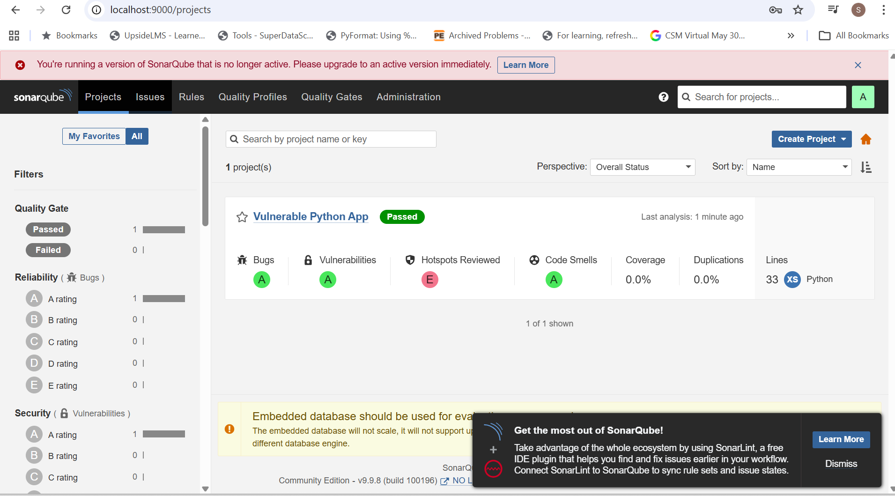
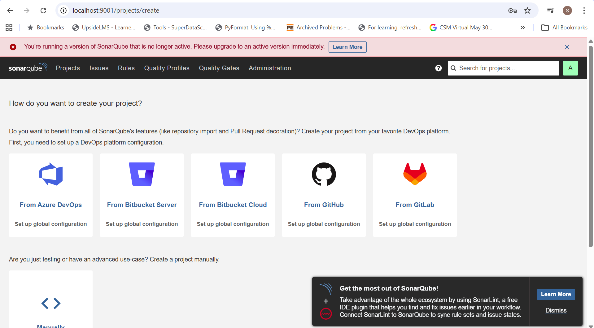
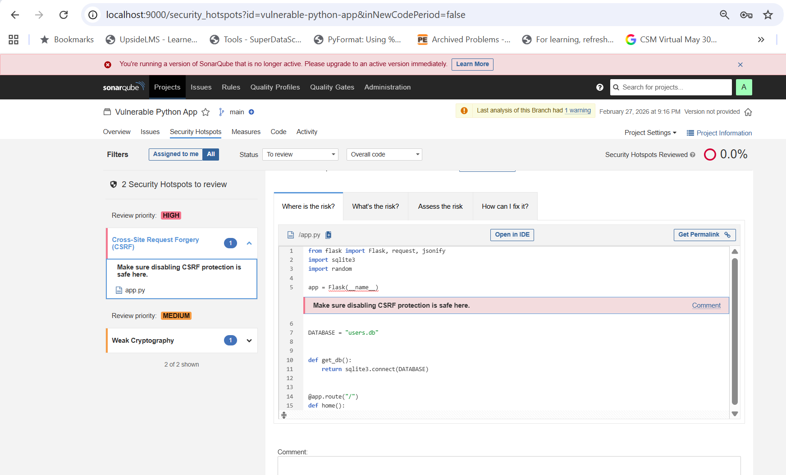

# 🔎 SAST Demo Using SonarQube (Community Edition)
## 🎯 Objective

Demonstrate Static Application Security Testing (SAST) using SonarQube Community Edition and Sonar Scanner CLI.

This demo shows:
- Running SonarQube via Docker
- Installing Sonar Scanner CLI
- Scanning a Python project
- Detecting vulnerabilities
- Reviewing security risks in SonarQube UI

### 🧠 What is SAST?

Static Application Security Testing (SAST) analyzes:
- Source code
- Configuration files
- Code patterns
- Security anti-patterns

It scans applications without executing them.

SAST detects:
- Hardcoded secrets
- Weak cryptography
- Insecure randomness
- Injection patterns
- Security misconfigurations
- Code smells
- Maintainability risks

#### 🏗 Architecture Overview
Developer Code → Sonar Scanner → SonarQube Server → UI Report

#### 🐳 Step 1 — Ensure Docker Desktop is Running

Since SonarQube will run as a Docker container, ensure:
- Docker Desktop is running
- Port 9000 is free

#### 🚀 Step 2 — Start SonarQube (Community Edition)

docker run -d -p 9000:9000 --name sonarqube sonarqube:9.9-community

#### 🌐 Open SonarQube UI
http://localhost:9000

#### 🔐 Default Credentials

Username: admin
Password: admin

#### 📸 Add Screenshot Here

#### 🐍 Step 3 — Prepare Python Environment

Create virtual environment:

python -m venv .venv

Activate environment (Windows Git Bash):
source .venv/Scripts/activate

Install dependencies:

pip install -r requirements.txt

#### 🛠 Step 4 — Install Sonar Scanner CLI

Follow official documentation:

🔗 https://docs.sonarsource.com/sonarqube-server/analyzing-source-code/scanners/sonarscanner

Install and add it to system PATH.

Verify installation:

sonar-scanner -v

#### 🔐 Step 5 — Generate SonarQube Token

In SonarQube UI:
- Go to My Account
- Navigate to Security
- Generate a new token
- Copy the token securely

#### 📄 Step 6 — Create sonar-project.properties

Create a file in project root:
sonar.projectKey=my-python-project
sonar.projectName=My Python Project
sonar.projectVersion=1.0
sonar.sources=.
sonar.host.url=http://localhost:9000
sonar.login=YOUR_TOKEN

Replace: TOKEN

#### ▶ Step 7 — Run Sonar Scanner

On Windows (Git Bash):

sonar-scanner.bat -Dsonar.host.url=http://localhost:9000 -Dsonar.login=YOUR_TOKEN

#### 📊 Step 8 — View Results in SonarQube UI

After scan completes:
- A new project appears in dashboard
- Vulnerabilities are categorized
- Risk levels are assigned

#### 🔥 Example Issue Found

SonarQube detected:
random.random()

#### ⚠ This is insecure for token generation.

Why?
- random.random() is predictable
- Not cryptographically secure
- Can lead to token forgery

Better alternative:
import secrets
secrets.token_hex()

#### 📈 Risk Categories in SonarQube
| Category          | Meaning                  |
| ----------------- | ------------------------ |
| Bugs              | Functional defects       |
| Vulnerabilities   | Security flaws           |
| Code Smells       | Maintainability issues   |
| Security Hotspots | Potential security risks |
| Technical Debt    | Time to fix issues       |

#### 🏭 Production Considerations

Community Edition:
- Basic vulnerability detection
- Limited security rules
- Good for POC and learning

Enterprise Edition:
- Advanced security rules
- Governance features
- Branch analysis
- Pull request decoration
- Better for production

####  🗄 SonarQube in Production

SonarQube requires:
- Persistent database (PostgreSQL recommended)
- Volume storage
- Token management

CI/CD integration

It can be deployed as:
- Docker container
- Virtual Machine
- Kubernetes Pod

#### 🔄 CI/CD Integration Example

In pipeline:
sonar-scanner -Dsonar.login=$SONAR_TOKEN

Pipeline can:
- Fail build on Quality Gate failure
- Block insecure merges
- Enforce security compliance

#### 🏆 Key Takeaways
- SAST scans code without executing it
- SonarQube detects vulnerabilities and anti-patterns
- Secure coding practices must follow remediation
- Enterprise SonarQube recommended for production
- Can integrate into DevSecOps pipelines
- Helps reduce technical debt

